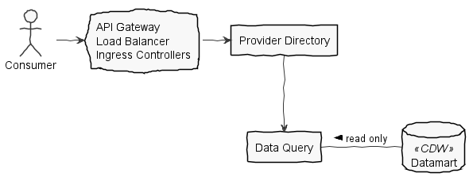

# This repo has been archived

Provider Directory Functionality is now handled by [yanartas](https://github.com/department-of-veterans-affairs/health-apis-yanartas).

# health-apis-provider-directory

An [NGINX](https://www.nginx.com) server for
[Provider Directory](http://hl7.org/fhir/us/davinci-pdex-plan-net/index.html) FHIR resources.
The underlying data is provided by the [Data Query](https://github.com/department-of-veterans-affairs/health-apis-data-query) API.

For details about available endpoints and interactions, refer to the
OpenAPI documentation on the
[Lighthouse Developer Portal](https://sandbox-api.va.gov/services/provider-directory/v0/r4/openapi.json).

## System Components

The API Gateway handles API key authentication and rate-limiting before traffic is received by this application.

- **Provider Directory** proxies requests for appropriate resources to `Data Query`
- **Data Query** is the underlying FHIR application that processes the requests
- **Datamart** is a database within the Corporate Data Warehouse that provides
  read-only data for Data Query (originating from VistA)

## Modules

- [provider-directory-nginx-proxy](provider-directory-nginx-proxy/README.md) - Main API implementation
- [provider-directory-tests](provider-directory-tests/README.md) - Integration tests

## Local Development

Refer to [health-apis-parent](https://github.com/department-of-veterans-affairs/health-apis-parent)
for basic environment setup. (Java, Maven, Docker, etc.)
Execute `mvn clean install` to build all of the modules.
